# Diagnóstico e Melhoria da Rede Corporativa

Projeto Integrado de **Redes de Computadores e Algoritmos**, desenvolvido para a **MF Tecnologia e Sistemas**.

## Objetivo

Analisar a infraestrutura de rede atual da empresa, identificar riscos, gargalos e pontos únicos de falha e propor uma arquitetura mais segura, segmentada e resiliente.

A rede será representada como um grafo:

* dispositivos serão os nós;
* conexões serão as arestas;
* a latência será o peso das arestas;
* o algoritmo de Dijkstra será usado para encontrar caminhos de menor latência.

A solução proposta será validada pelo **relatório visual em HTML**, executado por
um servidor local Python. A página permite testar o algoritmo de Dijkstra,
comparar topologias e executar testes de conectividade da máquina.

## Etapas

1. Inventariar os dispositivos.
2. Medir latência e perda de pacotes.
3. Desenhar a topologia atual.
4. Modelar a rede como grafo.
5. Executar o algoritmo de Dijkstra.
6. Identificar gargalos e pontos críticos.
7. Criar uma nova arquitetura com VLANs, regras de acesso, firewall e VPN.
8. Testar a proposta pelo relatório HTML interativo.
9. Comparar a rede atual com a rede proposta.

## Arquitetura proposta

| VLAN | Setor           | Rede              |
| ---: | --------------- | ----------------- |
|   10 | Administração   | `192.168.10.0/24` |
|   20 | Desenvolvimento | `192.168.20.0/24` |
|   30 | Servidores      | `192.168.30.0/24` |
|   40 | IoT             | `192.168.40.0/24` |
|   50 | Visitantes      | `192.168.50.0/24` |
|   99 | Gerenciamento   | `192.168.99.0/24` |

## Funcionamento geral

```mermaid
flowchart LR
    A[Inventário da rede] --> B[Medições de latência e perda]
    B --> C[Topologia atual]
    C --> D[Modelagem em grafo]
    D --> E[Algoritmo de Dijkstra]
    E --> F[Identificação de caminhos e pontos críticos]
    F --> G[Projeto da nova arquitetura]
    G --> H[Relatório HTML interativo]
    H --> I[Testes de algoritmo e conectividade]
    I --> J[Comparação e conclusão]
```



## Como testar

Para usar o relatório visual dinâmico com botões de teste, execute:

```bash
python scripts/servidor_testes.py
```

Depois abra `http://127.0.0.1:8000` no navegador.

Se a porta `8000` ja estiver ocupada, use outra porta:

```bash
python scripts/servidor_testes.py 8001
```

Depois abra `http://127.0.0.1:8001`.

O relatório carrega automaticamente os arquivos `data/topologia_atual.json` e
`data/topologia_proposta.json`, preenche as opções de origem/destino e permite
testar Dijkstra, comparação entre topologias, ping, traceroute e dados da rede
local da máquina.

## Como rodar os testes

Os testes automatizados verificam o algoritmo, a validação das topologias, a
análise de gargalos e a leitura da saída de `ping`.

```bash
pip install -r requirements.txt
python -m pytest
```

Saída esperada: todos os testes passando (`... passed`). Rode sempre a partir da
raiz do projeto para que os módulos `src` e `scripts` sejam encontrados.

## Estrutura do projeto

O que é cada arquivo e pasta:

| Caminho | O que é |
| --- | --- |
| `main.py` | Linha de comando (CLI). Subcomandos `caminho`, `gargalos` e `comparar`. |
| `src/grafo.py` | Estrutura de dados do grafo (nós, arestas, latências) e carga/validação do JSON. |
| `src/dijkstra.py` | Algoritmo de Dijkstra: menor caminho e custo entre dois pontos. |
| `src/analise.py` | Compara as duas topologias e aponta os nós mais usados (gargalos). |
| `scripts/medir_rede.py` | Mede latência/perda reais com `ping` e grava em `data/medicoes.csv`. |
| `scripts/servidor_testes.py` | Servidor local Python que serve o relatório HTML e expõe a API de testes. |
| `data/topologia_atual.json` | Rede de hoje (sem segmentação) como grafo. |
| `data/topologia_proposta.json` | Rede nova (VLANs, firewall, link redundante) como grafo. |
| `data/medicoes.csv` | Histórico das medições de latência/perda. |
| `tests/` | Testes automatizados (pytest) de cada módulo. |
| `docs/` | Relatórios HTML/PDF, diagramas `.mmd` e guias. |

## Conceitos-chave

Explicação rápida do que cada termo significa neste projeto:

* **Grafo** — modelo da rede: um conjunto de pontos ligados por linhas.
* **Nó (vértice)** — um dispositivo da rede (PC, servidor, switch, roteador...).
* **Aresta** — uma conexão entre dois dispositivos.
* **Peso / latência** — o "custo" de uma conexão, em milissegundos (ms). Quanto
  menor, mais rápida.
* **Dijkstra** — algoritmo que encontra o caminho de menor latência somada entre
  uma origem e um destino. Exige pesos não negativos.
* **Gargalo / ponto único de falha** — nó por onde passam muitos caminhos; se ele
  cair, grande parte da rede para. O subcomando `gargalos` ajuda a identificá-los.
* **VLAN** — rede virtual que separa setores (ex.: Administração, IoT, Visitantes)
  em faixas de IP próprias, melhorando segurança e organização.
* **Redundância de link** — segundo caminho de saída (ISP2) que assume se o
  principal (ISP1) falhar.

## Documentação

* [Arquitetura do projeto](docs/ARQUITETURA.md)
* [Relatório do Projeto Integrado (HTML)](docs/relatorio_projeto_integrado.html)
* [Relatório visual em HTML](docs/relatorio_visual.html)
* [Guia de testes pelo HTML](docs/guia_testes_html.md)
* [Topologia atual](docs/topologia_atual.mmd)
* [Topologia proposta](docs/topologia_proposta.mmd)
* [Funcionamento da rede proposta](docs/funcionamento_rede_proposta.mmd)
* [Fluxograma do Dijkstra](docs/fluxograma_dijkstra.mmd)
* [Visão geral do projeto](docs/visao_geral_projeto.mmd)

## ODS

O projeto está relacionado ao **ODS 9 — Indústria, Inovação e Infraestrutura**, por propor melhoria da infraestrutura tecnológica, da segurança e da disponibilidade dos serviços.

## Observação

Os endereços, equipamentos e valores apresentados inicialmente são uma proposta de laboratório. Antes da entrega, deverão ser ajustados conforme o inventário e as medições reais da empresa.
